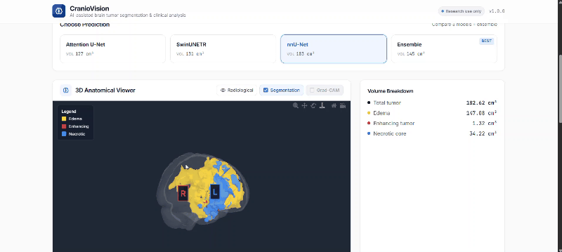

<div align="center">

# CranioVision

**AI-Assisted Clinical Platform for 3D Brain Tumor Segmentation, Anatomical Analysis, and Explainable Volumetric Analysis**

[](https://www.python.org/)
[](https://pytorch.org/)
[](https://monai.io/)
[](https://fastapi.tiangolo.com/)
[](https://nextjs.org/)
[](#license)
[](https://www.synapse.org/brats2024)
[]()

[Demo](#demo) · [Capabilities](#core-capabilities) · [Results](#final-results) · [Architecture](#architecture) · [Design Decisions](#design-decisions)

</div>

---

CranioVision is an end-to-end clinical platform that takes multi-modal brain MRI volumes (T1, T1c, T2, FLAIR) and produces **clinically interpretable** tumor segmentations from four independent prediction sources — three deep learning models plus a consensus ensemble — letting the radiologist choose which output to trust. Each prediction is paired with anatomical context (Harvard-Oxford atlas), eloquent cortex proximity analysis, model attention heatmaps via Grad-CAM, and per-region tumor volumes in cm³.

The project addresses a real gap in clinical tooling. Commercial systems like BrainLab and iPlan are prohibitively expensive. Open research prototypes such as DSNet and TumorPrism3D stop at single-model inference. CranioVision is the first accessible, open platform combining automated 3D tumor segmentation with multi-model second-opinion logic, atlas-based anatomical reasoning, surgical risk analysis, and Grad-CAM explainability in one deployable system.

---

## Demo

[](assets/demo.mp4)

[**Watch the full demo video →**](assets/demo.mp4)

The demo walks through the full clinical workflow: drag-and-drop a BraTS case, watch the pipeline run all three models plus ensemble plus atlas analysis, explore the rotatable 3D brain mesh viewer, switch between model predictions, generate Grad-CAM explanations, and download the 5-page clinical PDF report.

---

## Core Capabilities

| Capability | What It Does | Why It Matters Clinically |
|---|---|---|
| **3-Model Segmentation** | Predicts tumor regions with Attention U-Net, SwinUNETR, and nnU-Net-style DynUNet | Three independent opinions — radiologist sees if models agree |
| **Weighted Ensemble** | Combines all three via Dice-proportional soft voting | Provides a fourth "consensus" prediction with built-in confidence signal |
| **Volume Quantification** | Per-region tumor volume in cm³ with 7.5% mean relative error vs. ground truth | Required for RANO tumor response assessment |
| **Atlas-Based Anatomical Analysis** | ANTs registration to MNI152, Harvard-Oxford lobe and region labeling | Tells the surgeon *where* the tumor is in standardized space |
| **Eloquent Cortex Risk Assessment** | Per-region distance to functional cortex with traffic-light risk classification | Flags surgical risks (motor, speech, vision) before the OR |
| **Grad-CAM XAI** | Shows what the model attends to for each tumor class | Builds clinical trust; validates model is not looking at noise |
| **Multi-Model Agreement Map** | Highlights voxels where all 3 models agree vs. disagree | Direct visual signal of which regions warrant manual review |
| **Interactive 3D WebGL Viewer** | Navigable atlas-space 3D brain mesh with integrated per-class tumors and Grad-CAM heatmaps | Intuitive spatial understanding and presentation-grade demoing |
| **Clinical PDF Report** | Auto-generated 5-page clinical reports with cross-model comparison and anatomical risk analysis | End-to-end delivery of insights to non-technical medical staff |

---

## Final Results

Evaluated on BraTS 2024 small subset: 140 train / 30 val / 30 test cases.

### Per-Model Performance on Test Set (n=30)

| Model | Params | Val Dice | Test Mean Dice | Edema | Enhancing | Necrotic |
|---|---|---|---|---|---|---|
| Attention U-Net | 23.6M | 0.7642 | 0.7308 | 0.858 | 0.676 | 0.658 |
| **SwinUNETR** | 62.2M | 0.8219 | **0.7929** | **0.903** | **0.721** | **0.755** |
| nnU-Net DynUNet | 31.4M | 0.7562 | 0.6925 | 0.845 | 0.560 | 0.672 |
| **Ensemble (3-model)** | — | — | 0.7853 | 0.906 | 0.690 | 0.760 |

SwinUNETR is the strongest single model. The ensemble matches its performance closely (within 1%) and adds an agreement-based confidence signal not available from any single model.

### BraTS Standard Region Dice

| Region | Attention U-Net | SwinUNETR | nnU-Net | Ensemble |
|---|---|---|---|---|
| Whole Tumor (WT) | 0.862 | 0.912 | 0.870 | **0.914** |
| Tumor Core (TC) | 0.711 | 0.810 | 0.745 | 0.806 |
| Enhancing Tumor (ET) | 0.676 | 0.721 | 0.560 | 0.690 |

### Multi-Model Agreement

| Metric | Value |
|---|---|
| Mean unanimous voxel fraction | **99.33%** |
| Minimum unanimous voxel fraction (hardest case) | 98.39% |
| Mean volume relative error vs. ground truth | 7.47% |

The very high agreement across three architecturally diverse models (CNN, Transformer, residual U-Net) is itself a clinically valuable signal. When all three models agree on a voxel, the prediction can be trusted deeply. The 0.7% of voxels where models disagree are typically tumor boundaries — exactly where radiologist review adds the most value.

### Why Four Predictions Are Presented, Not Just the Ensemble

The Dice-weighted ensemble achieves 0.7853 — statistically equivalent to SwinUNETR alone (0.7929). When one model is significantly stronger than its partners, classical ensembling provides minimal Dice gain. **The ensemble's role is therefore not to maximize Dice, but to serve as a consensus signal.** All four predictions (three models + ensemble) are presented in the clinical interface; the radiologist decides which output to trust, with explicit visualization of where they agree and disagree.

---

## Architecture

```
                      MRI input (T1, T1c, T2, FLAIR)
                                    │
                                    ▼
              ┌─────────────────────────────────────────┐
              │        Preprocessing (MONAI)            │
              │  • Orientation → RAS                    │
              │  • Z-score normalization (per-modality) │
              │  • Foreground crop                      │
              └─────────────────────────────────────────┘
                                    │
           ┌────────────────────────┼────────────────────────┐
           ▼                        ▼                        ▼
  ┌────────────────┐      ┌─────────────────┐      ┌────────────────┐
  │ Attention U-Net│      │   SwinUNETR     │      │ nnU-Net-style  │
  │    (23.6M)     │      │    (62.2M)      │      │    (31.4M)     │
  └────────────────┘      └─────────────────┘      └────────────────┘
           │                        │                        │
           └────────────────────────┼────────────────────────┘
                                    ▼
              ┌─────────────────────────────────────────┐
              │   Dice-weighted soft voting (ensemble)  │
              └─────────────────────────────────────────┘
                                    │
       ┌──────────────┬─────────────┼─────────────┬──────────────────┐
       ▼              ▼             ▼             ▼                  ▼
  ┌──────────┐  ┌────────────┐ ┌───────────┐ ┌────────────┐ ┌───────────────┐
  │ Volumes  │  │ ANTs atlas │ │ Eloquent  │ │  Grad-CAM  │ │  Agreement    │
  │  (cm³)   │  │  + anatomy │ │  cortex   │ │ explainer  │ │     map       │
  └──────────┘  └────────────┘ └───────────┘ └────────────┘ └───────────────┘
                                    │
                                    ▼
              Radiologist interface — all 4 predictions shown,
              user selects which to trust per case
```

The frontend provides an interactive experience where radiologists can view these outputs in an exploratory 3D space, toggle Grad-CAM heatmaps directly onto the tumor meshes, and generate offline clinical PDF reports quantifying surgical risk per region.

---

## Models

### Attention U-Net (Oktay et al., 2018)
Standard U-Net with attention gates at each skip connection. The gates suppress irrelevant features (skull, healthy tissue) and emphasize tumor regions. Strong baseline for diffuse structures like edema. High recall on whole tumor.

### SwinUNETR (Hatamizadeh et al., 2022)
Swin Transformer encoder paired with a CNN decoder. The transformer's self-attention captures global context — especially useful for small enhancing-tumor cores that conventional CNNs struggle with. Consistently tops BraTS leaderboards. **Strongest single model in this pipeline.**

### nnU-Net-style DynUNet (Isensee et al., 2021)
Residual-block encoder/decoder with instance normalization. Uses nnU-Net's architectural plan for brain MRI (6-level encoder, filter schedule 32→320, deep supervision). Provides architectural diversity to the ensemble — different inductive biases, different failure modes.

---

## Design Decisions

**Three architecturally diverse models, not three identical ones.** Attention U-Net (CNN with attention gates), SwinUNETR (Transformer encoder), and DynUNet (residual U-Net) make different errors on different cases. This diversity is what makes the agreement signal meaningful — three identical models would always agree.

**Dice-proportional ensemble weights, not equal voting.** Each model's vote is weighted by its validation Dice (SwinUNETR ≈ 0.35, Attention U-Net ≈ 0.33, nnU-Net ≈ 0.32). Equal voting would give the weakest model too much influence.

**Ensemble for confidence, not raw performance.** When one model is significantly stronger than its partners, classical ensembling provides minimal Dice gain. The ensemble's agreement statistic is therefore used as a clinical confidence indicator — when all three models agree on a voxel, that voxel can be trusted; disagreement flags review.

**Atlas-based anatomy in MNI space, not patient native space.** Tumor location is reported in MNI152 standardized coordinates with Harvard-Oxford region labels. This is the universal language of neuroimaging research and enables cross-patient comparison. Patient-native rendering exists for surgical-navigation tools (BrainLab, StealthStation); CranioVision is purposefully a research and second-opinion platform.

**Single shared XAI explainer.** Attention U-Net is the explainer for all four predictions, regardless of which the user is viewing. Empirical analysis showed it produces consistently strong Grad-CAM heatmaps (9-15× signal-to-background ratio), while heatmaps from the other architectures are unreliable. The PDF report explicitly discloses this surrogate-explainer architecture.

**Patch-based Grad-CAM with post-processing.** Full-volume Grad-CAM requires roughly 7 GB of gradient storage. The pipeline locates the tumor via a cheap forward pass, crops a 128³ patch around it, computes Grad-CAM there, and stitches back. Gaussian smoothing, brain masking, and threshold cleanup remove patch-edge artifacts and air-region activations.

**Memory-efficient inference for 4 GB GPUs.** Inference loads one model at a time, saves softmax probabilities to disk, frees GPU memory, and performs final voting on CPU. The full 3-model pipeline runs on a GTX 1650 4 GB without memory pressure.

---

## Tools Used

| Domain | Tool |
|---|---|
| Deep learning | PyTorch 2.5 |
| Medical imaging primitives | MONAI 1.5.2 |
| Volume IO | nibabel, SimpleITK |
| Atlas registration | ANTs (antspyx) |
| Visualization | matplotlib, Plotly (Mesh3d), scikit-image, Three.js |
| Frontend | Next.js 14, React 18, TypeScript, Tailwind CSS |
| Backend | FastAPI, Pydantic, Server-Sent Events |
| Reporting | reportlab |
| Testing | pytest |
| Version control | Git + GitHub (multi-branch workflow) |
| Compute | Local GTX 1650 (dev), Kaggle T4 (training) |

---

## Project Status

| Phase | Description | Status |
|---|---|---|
| **Phase 1** | Foundation + Three-model training | ✅ Complete |
| **Phase 2** | Inference, ensemble, MC Dropout uncertainty, Grad-CAM XAI | ✅ Complete |
| **Phase 3** | ANTs atlas registration, Harvard-Oxford anatomy, eloquent cortex analysis, 5-page clinical PDF | ✅ Complete |
| **Phase 4** | FastAPI backend + Next.js frontend, interactive 3D viewer, deployment-ready | ✅ Complete |

---

## Author

**Heshan Ranasinghe**
Electronic and Telecommunication Engineering
Faculty of Engineering, University of Moratuwa
Sri Lanka

---

## Key References

1. Oktay et al. (2018). *Attention U-Net: Learning Where to Look for the Pancreas.* arXiv:1804.03999
2. Hatamizadeh et al. (2022). *Swin UNETR: Swin Transformers for Semantic Segmentation of Brain Tumors in MRI Images.* arXiv:2201.01266
3. Isensee et al. (2021). *nnU-Net: a self-configuring method for deep learning-based biomedical image segmentation.* Nature Methods 18(2):203-211.
4. Avants et al. (2008). *Symmetric diffeomorphic image registration with cross-correlation: Evaluating automated labeling of elderly and neurodegenerative brain.* Medical Image Analysis 12(1):26-41.
5. Selvaraju et al. (2017). *Grad-CAM: Visual Explanations from Deep Networks via Gradient-based Localization.* ICCV 2017.
6. Desikan et al. (2006). *An automated labeling system for subdividing the human cerebral cortex on MRI scans into gyral based regions of interest.* NeuroImage 31(3):968-980.
7. Baid et al. (2021). *The RSNA-ASNR-MICCAI BraTS 2021 Benchmark on Brain Tumor Segmentation and Radiogenomic Classification.* arXiv:2107.02314.

---

## License

This repository is shared for **academic research and portfolio review purposes**. It is not licensed for clinical deployment, commercial use, or direct redistribution. Clinical deployment requires additional validation, regulatory approval, and a formal licensing arrangement with the author.

For research collaboration or licensing inquiries, please contact the author through institutional channels.